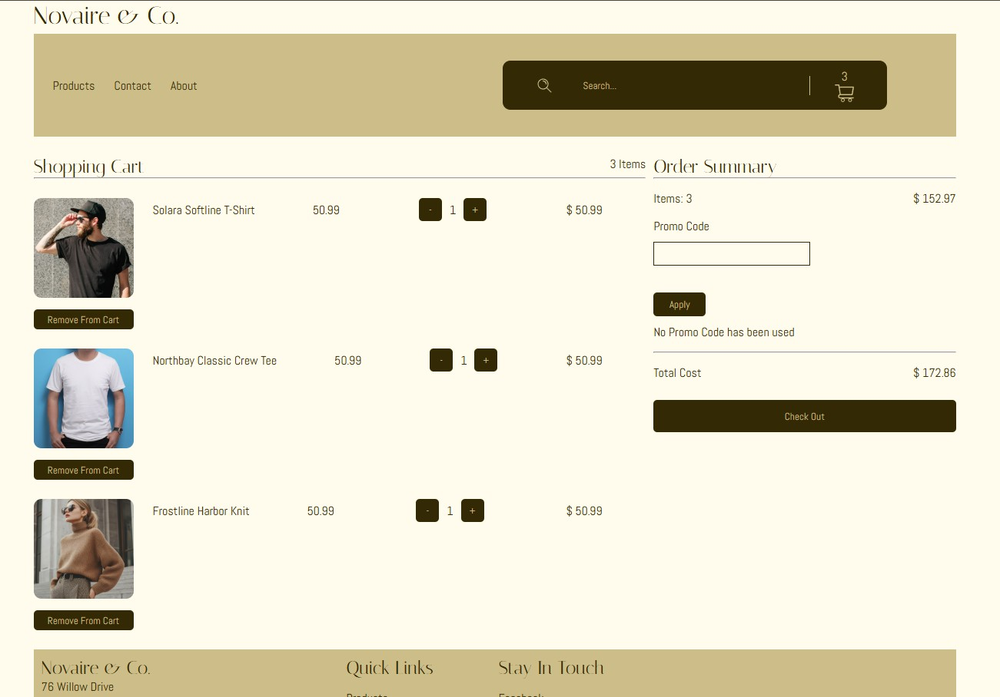

# E-Commerce Clothing Application: Built with React 




## Premise of the Challenge

The premise of the challenge was to create an MVP for a clothing brand website within 7 days from start to finish. Due to the limitations of time and this being my first time completing a project in React, I set myself what I thought to be a realistic goal for what I wanted the site to look like at the end of the 7 days.


## Tech Stack

- React
- React Router
- JavaScript (ES6)
- CSS Grid / Flexbox
- Vite

**Completion Requirements:** 
- 4 completed pages (Homepage, Contact, Products, and Shopping Cart)
- All 4 pages should be responsive from mobile to desktop 
- Images need to be optimized for the webpages 
- The products page should include filtering 
- You should be able to add products to a cart and it should persist when navigating to the various pages
- The shopping cart page should provide a summary of all products in the users cart as well as the functionality to remove items

**Future Improvements**
- Backend and API integration 
- Payment integration 
- Design an actual logo  
- Choose photos with actual intention so they blend well together  
- Pagination on the products page 
- Functional contact form  
- Make the join newsletter input functional 


## Features

### Image Carousel 

- I set up the image carousel by using `useState` and setting the value to be the URL of the currently displayed image. When the user clicks on one of the radio buttons that overlay the image, it will trigger an `onChange` event, and using the value of the radio button which they've selected, it will update the current state value 

```jsx
let carouselArray = [
    '/images/carousel/carousel-1.jpg', 
    '/images/carousel/carousel-2.jpg', 
    '/images/carousel/carousel-3.jpg', 
    '/images/carousel/carousel-4.jpg'
];

const [currentCarouselImg, setCurrentCarouselImg] = useState(carouselArray[0]);

function updateCarousel(e) {
    let currentCarouselIndex = Number(e.target.value);

    setCurrentCarouselImg(carouselArray[currentCarouselIndex]);
}
//...
<section className="carousel grid-con">
    

    <div className='carouselBtns'>
        {
            carouselArray.map((_, index) => (
                <input 
                    key={index}
                    type='radio'
                    name='imageSelect'
                    value={index}
                    onChange={updateCarousel}
                />
            ))
        }
    </div>
</section>
```

### Product Filtering 

- `productsData` is imported in from a JSON file as an array of objects and then saved to the variable `originalProducts` within the parent component (`<AppLayout />`) and passed to the Products component using `useOutletContext`
- `setCategory`, `setMaxPrice`, and `setColour` are passed into the Filter component where their states are updated based on radio button selections
- The `useEffect` runs after the component is rendered (as long as one of the three values has been changed), updating the filteredProducts state and triggering a re-render with the correct products displayed.

```jsx
const { cartItems, setCartItems, originalProducts } = useOutletContext();

const [filteredProducts, setFilteredProducts] = useState(originalProducts);

const [category, setCategory] = useState('');
const [maxPrice, setMaxPrice] = useState('');
const [colour, setColour] = useState('');

useEffect(() => {
    let newFiltered = originalProducts;

    if(category != '') {
        newFiltered = newFiltered.filter(p => p.category === category);
    }

    if(maxPrice != '') {
        newFiltered = newFiltered.filter(p => Number(p.price) <= Number(maxPrice));
    }

    if(colour != '') {
        newFiltered = newFiltered.filter(p => p.colours.includes(colour));
    }

    setFilteredProducts(newFiltered);

}, [category, maxPrice, colour])
//...

<section className='productGrid grid-con'>

    <div className='mobFilter col-span-full'>
         setIsOpen(prev => !prev)}/>
    </div>

    <div 
        className={isOpen ? 'tabFilter openFilter md:col-span-2 lg:col-span-3' : 'tabFilter md:col-span-2 lg:col-span-3'}
    >
        <Filter setCategory={setCategory} setMaxPrice={setMaxPrice} setColour={setColour} />
    </div>

    <section className='productCon col-span-full md:col-span-6 lg:col-span-9'>
        <ProductList products={filteredProducts} cartItems={cartItems} setCartItems={setCartItems}/>
    </section>

</section>
```

### Fully Responsive across mobile to desktop 

- Responsiveness is done through the use of CSS grid layout and flexbox, with the grid closely resembling tailwind classes. 
- The grid is kept in a folder named `global` within the src folder and then used across all the other pages

```css
.grid-con {
    display: grid;
    grid-template-columns: repeat(4, 1fr);
    column-gap: 10px;
    row-gap: 5px;
    width: 412px;
    margin: 0px auto;
}

@media (min-width: 768px) {
    .grid-con {
        grid-template-columns: repeat(8, 1fr);
        width: 768px; 
    }

}

@media (min-width: 1200px) {
    .grid-con {
        grid-template-columns: repeat(12, 1fr);
        width: 1200px;  
    }
}

.col-span-1 { grid-column: span 1 / span 1; }
/* ... */
```


### Shopping Cart Summary page 

- In order for cart information to persist across all of the pages, I stored state within the common parent component (`<AppLayout />`) with the state variables being passed as `props` to the header or as `Outlet context` to the other components
- I set up a single 'card' for what each cart item should look like, and then used `map()` to iterate over `cartItems` which had been passed from `<AppLayout/>` and display each as a item card. 

```jsx
function CartItem({item, removeFromCart, increaseQuantity, decreaseQuantity}) {
    return (
        <div className='cartItem'>
            <div className='cartImage'>
                
                <button onClick={() => removeFromCart(item)}>Remove From Cart</button>
            </div>

            <div className='cartItemDetails'>
                <div className='itemName'>
                    <p>{item.name}</p>
                    <p>{item.price}</p>
                </div>                
            
                <div className='itemQuantity'>
                    <button onClick={() => decreaseQuantity(item)}>-</button>
                    <p>{item.purchaseQuantity}</p>
                    <button onClick={() => increaseQuantity(item)}>+</button>
                </div>

                <div className='itemTotal'>
                    <p className='totalTitle'>Total</p>
                    <p>$ {(Number(item.price) * Number(item.purchaseQuantity)).toFixed(2)}</p>
                </div>
            </div>
        </div>
    )
}

function CartList({cartItems, setCartItems}) {

    function removeFromCart(item) {
        setCartItems(prev => prev.filter(p => p.id !== item.id))
    }

    //...

    return (
        <>
            {cartItems.map(item => (
                <CartItem key={item.id} item={item} removeFromCart={removeFromCart} increaseQuantity={increaseQuantity} decreaseQuantity={decreaseQuantity}/>
            ))}
        </>
    )
}

export default function ShoppingCart() {
    const { cartItems, setCartItems, usedPromo, setUsedPromo } = useOutletContext();

    //...

    return (
        <main>
            <div className="grid-con">

                <section className='shoppingCartItems col-span-full md:col-span-4 lg:col-span-8'>
                    <div className='shoppingCartTitle'>
                        <h2>Shopping Cart</h2>
                        <p>{totalQuantity} Items</p> 
                    </div>
                    <hr />

                    <CartList cartItems={cartItems} setCartItems={setCartItems}/>

                </section>
            </div>

        </main>
    )
}
```

## Challenges 

I found that the biggest challenge I faced during this project came from `backtracking`. Having never created a project in React before, there were design choices that I didn't really consider until after I'd already written the code and therefore had to go back and change the way it was structured. 

- State Management: 
    - Originally, I had placed state for the products array within the Products page, however, once I got around to designing the shopping cart page I realised that in order for all pages to have access to the information it needed to be placed in `<AppLayout />` which meant I had to go back and restructure how state was passed to the different components. 
    - for an app of this size it wasn't a considerably large job, but it is definitely something I will pay more attention to going forward

- Responsiveness 
    - This was another problem that I simply could have saved time on if I had done it to begin with rather than leaving it to the end.
    - Because I was so focused on including the functionality for the application, I didn't originally make the `hamburger menu` or `filter button` functional as they were only used at mobile size and I figured it wouldn't take that long to add it
    - Because the original styling was setup for tablet and desktop, it took longer to rewrite the styles to be mobile first as I couldn't just change the styling or else it would have broken. 

- Another challenge I faced was getting used to relying on React for UI changes. Once I learned that you could use `useRef` to hook into elements (almost like `getElementById`) I found myself wanting to use it in multiple scenarios where it was more appropriate to be using `useState` instead. 

- Not specifically code related, but this 7 day challenge has also made me realise the importance of factoring in 'unforeseen' circumstances when making / accepting deadlines. When planning out the 7 days, I knew I had the entire time to work on the project without other commitments such as work or school, which led me to believe I could put in 8 hour days. However, all projects should have buffer room to account for 'emergencies' or other 'commitments'
    - For me, I had overlooked that the 7 days ran straight through Mother's day and that I would lose a day to plans with family 
    - I also developed a cold during the week and was therefore not performing at my best


## Installation

Clone the repository:

```bash
git clone https://github.com/cunderhill17/ecommerce-react-app.git
```

Navigate into the project directory:

```bash
cd e-commerce-clothing
```

Install dependencies:

```bash
npm install
```


## Usage

Start the development server:

```bash
npm run dev
```

Open your browser and visit:

```txt
http://localhost:5173
```


## Contributing

1. Fork it!
2. Create your feature branch: `git checkout -b my-new-feature`
3. Commit your changes: `git commit -am "Add some feature"`
4. Push to the branch: `git push origin my-new-feature`
5. Submit a pull request 


## Credits

- Crystal Underhill 


## License 

This project is licensed under the MIT License. See the LICENSE file for details. 